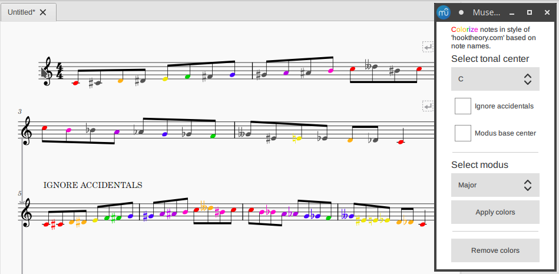

# musescore-plugin-colornotes-hooktheory
Theese plugins color notes depending on their pitch, or notenames in "Hooktheory Hookpad" style (and more).

## Pitch based

## Name based

## Donate
If You found it useful, You can [buy me a beer](https://www.paypal.com/donate?business=8R9HV9AM4VFRS&no_recurring=0&item_name=Musescore+Plugins%0A+-+Scordatura%0A-+Colornotes+%22Hook+theory%22%0A-+Colornotes+Strings&currency_code=EUR).
Thank You!

